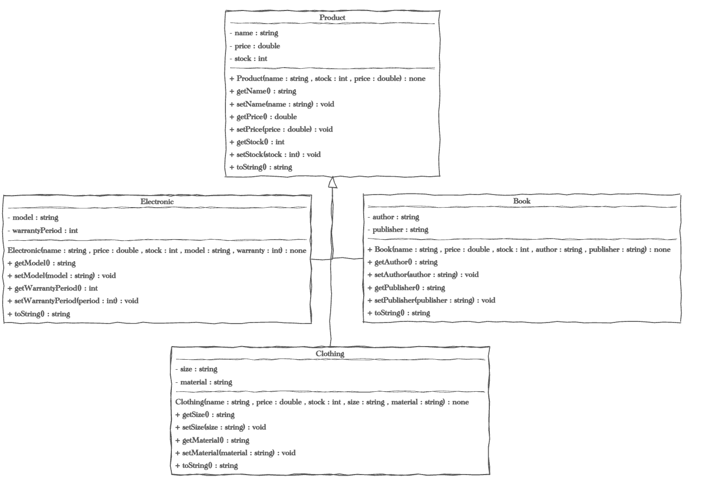
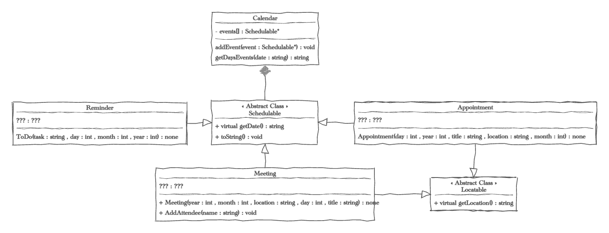
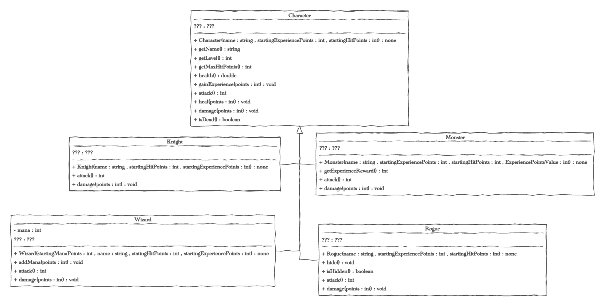

# Inheritance Lab

## Why this Assignment Matters
In this assignment you will work with Inheritance in several different ways.  Developing a deeper understanding of inheritance and the ways it is used and implemented. 

# Developing and testing.
As you work through each of the sections use the interface instructions and URL to complete the required classes.  In you driver you should demonstrate each class as well as how the classes work together. Be sure to read each section for additional requirements for your Drivers.

To simplify things I've placed each group of classes in their own sub-folders in the project files. 

## Grading rubric 100 points


| Points | Requirements                             |
|--------|------------------------------------------|
|        | **Products**                             | 
| 5      | Product Base Class                       |
| 5      | Electronic Derived Class                 |
| 5      | Clothing Derived Class                   |
| 5      | Book Derived Class                       |
| 5      | ProductDriver  (hand graded)             |
|        | **Calendar**                             | 
| 5      | Schedulable & Locatable Abstract Classes |
| 5      | Reminder Derived Class                   |
| 5      | Appointment Derived Class                |
| 5      | Meeting Derived Class                    |
| 5      | Calendar Class                           |
| 5      | CalendarDriver (hand graded)             |
|        | **Character**                            | 
| 5      | Character Base Class                     |
| 5      | Character Base Knight Derived Class      |
| 5      | Character Base Monster Derived Class     |
| 5      | Character Base Wizard Derived Class      |
| 5      | Character Base Rogue Derived Class       |
| 5      | Character Driver  (hand graded)          |
| 15     | Style  (hand graded)                     |

## Products
In this section you'll build 3 kinds of product from derived from a product base class. Each one inheriting functionality from the Product class but also having unique properties and behavior.  The driver should demonstrate all the methods for each class both inherited and from the class itself. Also in the Driver demonstrate Polymorphism by loading 30 products (10 of each derived class) into an Array or Vector of Products. Then output a stock report that shows a total products, their value and the total value of inventory. See the example output below. 


Product Interface:
* Product(string name, double price, int stock) -- Constructor
* const string getName() -- returns the product name 
* void setName(string name) -- sets the product name  
* double getPrice() -- returns the product price 
* void setPrice(double price) -- sets the product price
* int getStock() -- returns the number of this product in stock
* void setStock(int stock) -- sets the number of products in stock
* virtual string toString() -- outputs a string representation of a product must contain the product name but can contain more product information if you wish. 

Electronic interface:
* Inherits all methods from Product
* Electronic(string name, double price, int stock, string model, int warranty ) -- Constructor 
* string getModel() -- returns the model
* void setModel(string model) sets the model
* int getWarrantyPeriod() returns the Warranty Period in years 
* void setWarrantyPeriod(int period) -- sets the Warranty Period in years 
* string toString() override -- outputs a string representation of the electronics must contain the product name and model but can contain more product information if you wish.

Clothing Interface:
* Inherits all methods from Product
* Clothing(string name, double price, int stock, string size, string material) -- Constructor
* string getSize() -- returns the size
* void setSize(string size) -- sets the size
* string getMaterial() -- returns the material
* void setMaterial(string material) sets the material
* string toString()-- outputs a string representation of a clothing object must contain the product name and size but can contain more product information if you wish.

Book Interface: 
* Inherits all methods from Product
* Book(string name, double price, int stock, string author, string publisher) -- Constructor
* string getAuthor() -- returns the author
* void setAuthor(string author) -- sets the author
* string getPublisher() -- returns the publisher
* void setPublisher(string publisher) -- sets the publisher
* string toString() -- outputs a string representation of a book must contain the product name and author but can contain more product information if you wish.

Example of an "Inventory Report" based on products" 
```text 
Name                                                   Price     Stock               Value
------------------------------------------------------------------------------------------
Jeans, Denim (L)                                       49.99        50             2499.50
Sweater, Wool (S)                                      39.99        30             1199.70
Jacket, Leather (XL)                                   99.99        20             1999.80
T-Shirt, Cotton (M)                                    19.99       100             1999.00
Hoodie, Cotton (XL)                                    59.99        40             2399.60
Apple Watch Series 7 Model:A2473                      399.00        50            19950.00
To Kill a Mockingbird, By Harper Lee                    7.99       100              799.00
Dell XPS 13 Model:XPS13-9301                          999.00        15            14985.00
Google Pixel 6 Model:GG1-7000                         599.00        40            23960.00
Pride and Prejudice, By Jane Austen                    11.99       100             1199.00
1984, By George Orwell                                  9.99        85              849.15
Scarf, Wool (One Size)                                 24.99        35              874.65
Crime and Punishment, By Fyodor Dostoevsky             18.99        70             1329.30
Shorts, Cotton (L)                                     29.99        60             1799.40
MacBook Air Model:A2337                               999.00        20            19980.00
Samsung Galaxy S22 Model:SM-S901U                     799.99        25            19999.75
Fitbit Versa 3 Model:FB511                            229.95        70            16096.50
Tank Top, Cotton (S)                                   14.99        80             1199.20
Moby Dick, By Herman Melville                          12.99        75              974.25
Canon EOS R6 Model:3454C001                          2399.00        10            23990.00
The Odyssey, By Homer                                  10.99       200             2198.00
The Catcher in the Rye, By J.D. Salinger                8.99       110              988.90
Socks, Cotton (M)                                       7.99       200             1598.00
War and Peace, By Leo Tolstoy                          19.99        65             1299.35
Ulysses, By James Joyce                                16.99        80             1359.20
Sony A7 IV Model:ILCE-7M4                            2499.99         8            19999.92
Apple iPhone 13 Model:A2489                           699.00        30            20970.00
GoPro HERO10 Black Model:CHDHX-101                    499.99        35            17499.65
Coat, Polyester (M)                                   149.99        15             2249.85
The Great Gatsby, By F. Scott Fitzgerald               14.99       120             1798.80
------------------------------------------------------------------------------------------
                                                                                 228044.47
```

Feel free to have chatGPT or some other service generate mock date but do not use it to write your code. See the iomaip fuctions [setw](https://cplusplus.com/reference/iomanip/setw/), [left and right](https://en.cppreference.com/w/cpp/io/manip/left) for more details on how to formation output into columns. 


## Calendar
In this example you're going to create and use two Abstract Classes, classes that contain pure virtual methods can not be instantiated  into objects themselves. The two abstract classes are the Schedulable and Locatable classes.  The Appointment, Reminder and Meeting classes will all be derived from Schedulable.  The Appointment and Meeting classes will also inherit from Locatable using multiple inheritance. You'll then demonstrate another form of Polymorphism (and a touch of Aggregation) in the Calendar class by passing all three to the addEvent method.

The CalendarDriver should demonstrate each derived class implementing all the required methods individually.  Then demonstrate a Calendar object that with "Events" of all three derived classes.  Show the output of a calendar date that has multiple events from multiple derived classes. 

Note: This exercise could be flushed out much more by added getters and setters as well at much richer features. However, I tried to limit the scope of the exercise to just what is needed to understand the use of abstract classes. 



Schedulable Interface: 
* pure virtual string getDate()  -- should return the objects date as string with a specific format of "MM/DD/YYY" for example "01/08/2011" or "12/03/1076"
* pure virtual string toString()  -- should return a string representation of the object

Locatable Interface:
* pure virtual string getLocation() -- should return a string containing the location of the object

**Note:** Schedulable and Locatable are abstract classes, there should be no implementation (.cpp) file, you only require a header (.h) file.

Reminder Interface:
* Implements all the methods from Schedulable
* Reminder(int year, int month, int day, string task) -- Constructor

Appointment Interface:
* Implements all the methods from Schedulable 
* Implements all the methods from Locatable 
* Appointment(int year, int month, int day, string title, string location) -- Constructor 

Meeting Interface:
* Implements all the methods from Schedulable
* Implements all the methods from Locatable
* void addAttendee(string name) -- adds a attendee to the meeting. (when implementing toString all attendees should be included.)

Calendar Interface:
* Calendar() -- default constructor
* void addEvent(Schedulable *event) -- adds an event of type Schedulable to the calendar. You can same the event internally in any collect type you wish, I recommend a vector for simplicity.  
* string getDaysEvents(string date) -- returns a string representation of all the events on a given date.  The format of date should match the Schedulable getDate() method (MM/DD/YYYY). 

## Character 
In this section we are going to expand on the Knight Class from our previous lab.  More specifically, you are going to "push up" all the methods from the previous knight class into a more generic base class called Character. "Push up" is a term sometimes use to describe pushing methods up the inheritance chain so that more derived classes can be built off the base class.  

How you implement these new classes will very much depend on how you implemented the knight class in the previous assignment.  However, you should not feel bound to the implementation from the previous assignment.  Often when we abstract methods into base and derived classes new way to implement the classes come to light.  Feel free to modify the implementation if you discover a new/better way.



Rather than describing the interface for each class I'm going to say what should be different about each derived class.  

#### Character

The Character class should functions just like the Knight class from the previous assignment. 

#### Knight Class

The knight class wears heavy armor so when then take damage they only take halve the damage, in other words equal to 50% of the points passed. The Knight  attack value should be 5 * the knight's level.

#### Wizard Class

Wizards attack by casting magic fireballs as long as they have mana (magic points) to spend.  The fireball spell attack value should be 20 * the wizard's level.  Each time they cast fireballs they use up 25 mana points.  When all the magic is gone they can only bonk their opponents with their wand, which only does 10 points of damage. addMana should add to the Wizard's mana points. 

#### Rogue
Rogues are sneaky attackers.  If a Rogue is hidden they can attack for 15 * the rogue's level.  The hide() method make the rogue hidden until their next attack. They also only take 50% of normal damage if they are hidden at the time the damage() method is called. 

#### Monster
The monster is the class the other classes are "fighting" for now they do the same damage and attacks as the base Character class. However, when defeated they will give an Experience Points Reward. The getExperienceReward() method will return these points that could be awarded to the other characters. 

#### CharacterDriver 
Your CharacterDriver should demonstrate all the features of the derived classes both inherited and from the class itself. 

### Style and Efficiency Count

* Separate header (.h) and implementation (.cpp) files for all classes
* All variables should have self-commenting variable names.
* One statement per line, generally each line should also be less than 120 characters
* Proper indenting and spacing
* Each function, class and method should have documenting comments.
* Good descriptive comments for tricky parts of the code.
* You need to make sure your efficiency is as good as the examples we review in class.
* A lack of coding errors like memory leaks
* Your code should have proper use of const, virtual, and override keyword where appropriate. 

### Finishing up and Turning it in
1) For each driver copy the output to the test file in the Driver output folder.
2) Make should all your changes are committed and pushed to gitHub.
3) Copy the gitHub repository URL and paste it into the assignment submission in Canvas.
4) Congratulate yourself on a job well done.